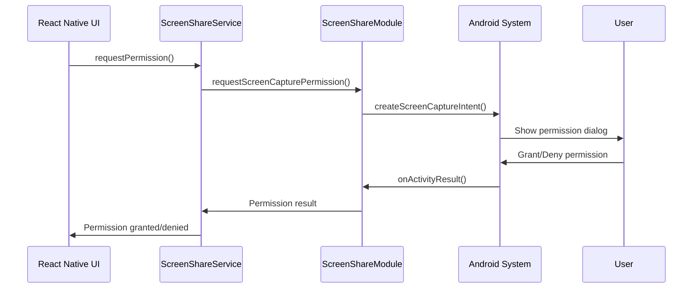
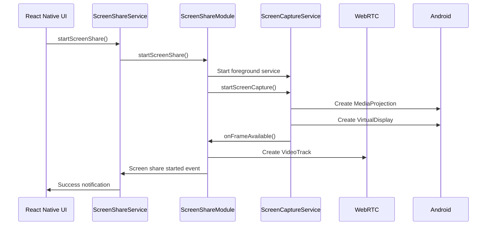
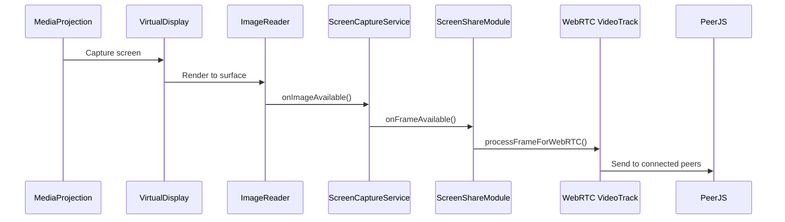

# Android Screen Sharing Implementation

This document describes the complete Android screen sharing implementation using MediaProjection, Foreground Service, react-native-webrtc, and PeerJS signaling.

## Architecture Overview

```
┌─────────────────┐    ┌──────────────────┐    ┌─────────────────┐
│   React Native  │    │  Native Android  │    │   WebRTC/P2P    │
│                 │    │                  │    │                 │
│ ScreenShareView │◄──►│ ScreenShareModule│◄──►│ PeerJS Signaling│
│ ConnectionsView │    │ ScreenCaptureServ│    │ MediaProjection │
│                 │    │                  │    │                 │
└─────────────────┘    └──────────────────┘    └─────────────────┘
```

## Components

### 1. Android Native Layer

#### ScreenCaptureService.java
- **Purpose**: Foreground service for MediaProjection screen capture
- **Features**:
  - Manages MediaProjection lifecycle
  - Creates VirtualDisplay for screen capture
  - Shows persistent notification during capture
  - Handles ImageReader for frame processing
  - Provides callbacks for React Native integration

#### ScreenShareModule.kt
- **Purpose**: React Native bridge module with WebRTC integration
- **Features**:
  - Manages MediaProjection permissions
  - Integrates with ScreenCaptureService
  - Creates WebRTC VideoTrack from screen frames
  - Provides event-driven architecture
  - Handles service binding and lifecycle

### 2. React Native Layer

#### ScreenCapture.ts
- **Purpose**: TypeScript interface for native modules
- **Features**:
  - Modern ScreenShareModule with full WebRTC integration
  - Legacy ScreenCaptureManager for compatibility
  - Event listeners for screen sharing events
  - Type-safe interfaces for all native methods

#### screenShareService.ts
- **Purpose**: High-level service for screen sharing management
- **Features**:
  - Integrates Android MediaProjection with PeerJS
  - Manages connected peers
  - Provides event callbacks
  - Handles permission requests and error states

### 3. UI Integration

#### ConnectionsScreenView.tsx
- **Purpose**: Main UI for screen sharing functionality
- **Features**:
  - Screen sharing controls
  - Permission handling
  - Status notifications
  - P2P connection management

## Implementation Flow

### 1. Permission Request Flow



### 2. Screen Share Start Flow



### 3. Frame Processing Flow



## Key Features

### 1. Android MediaProjection Integration
- **System Permission Dialog**: Shows Android's native "Start capturing everything on your screen?" dialog
- **Foreground Service**: Runs as a foreground service with persistent notification
- **VirtualDisplay**: Creates a virtual display for screen capture
- **ImageReader**: Processes screen frames for WebRTC transmission

### 2. WebRTC Integration
- **VideoTrack Creation**: Converts screen frames to WebRTC VideoTrack
- **Hardware Acceleration**: Uses EglBase for hardware-accelerated encoding
- **PeerConnectionFactory**: Manages WebRTC peer connections
- **Frame Processing**: Converts Android Image format to WebRTC VideoFrame

### 3. React Native Bridge
- **Event-Driven Architecture**: Uses NativeEventEmitter for real-time events
- **Type Safety**: Full TypeScript interfaces for all native methods
- **Error Handling**: Comprehensive error handling and user feedback
- **Lifecycle Management**: Proper cleanup and resource management

### 4. User Experience
- **Permission Flow**: Seamless permission request with system dialog
- **Status Notifications**: Real-time feedback on screen sharing status
- **Foreground Notification**: Shows "Screen Sharing Active" notification
- **Stop Controls**: Multiple ways to stop screen sharing

## Usage Example

```typescript
import { screenShareService } from '../services/screenShareService';

// Check support
const isSupported = await screenShareService.isSupported();

// Request permission
const hasPermission = await screenShareService.requestPermission();

// Start screen sharing
const result = await screenShareService.startScreenShare();
if (result?.success) {
  console.log('Screen sharing started:', result.streamId);
}

// Set up event listeners
screenShareService.setOnScreenShareStarted((streamId) => {
  console.log('Screen share started:', streamId);
});

screenShareService.setOnScreenShareStopped(() => {
  console.log('Screen share stopped');
});

// Stop screen sharing
await screenShareService.stopScreenShare();
```

## Android Permissions Required

```xml
<!-- Required permissions in AndroidManifest.xml -->
<uses-permission android:name="android.permission.INTERNET" />
<uses-permission android:name="android.permission.RECORD_AUDIO" />
<uses-permission android:name="android.permission.FOREGROUND_SERVICE" />
<uses-permission android:name="android.permission.FOREGROUND_SERVICE_MEDIA_PROJECTION" />
<uses-permission android:name="android.permission.FOREGROUND_SERVICE_SPECIAL_USE" />

<!-- Foreground service declaration -->
<service
  android:name=".ScreenCaptureService"
  android:enabled="true"
  android:exported="false"
  android:foregroundServiceType="mediaProjection|specialUse">
  <property
    android:name="android.app.PROPERTY_SPECIAL_USE_FGS_SUBTYPE"
    android:value="screen_sharing" />
</service>
```

## Error Handling

### Common Error Scenarios
1. **Permission Denied**: User denies screen capture permission
2. **MediaProjection Failure**: MediaProjection stops unexpectedly
3. **Service Binding Failure**: Failed to bind to ScreenCaptureService
4. **WebRTC Initialization**: WebRTC components fail to initialize
5. **Network Issues**: P2P connection failures

### Error Recovery
- Automatic cleanup on errors
- User-friendly error messages
- Retry mechanisms for transient failures
- Graceful degradation when features unavailable

## Testing

### Device Requirements
- Android API 21+ (Lollipop)
- Physical Android devices (emulator limitations)
- Network connectivity for P2P connections

### Test Scenarios
1. **Permission Flow**: Test grant/deny scenarios
2. **Screen Capture**: Verify screen content is captured
3. **Foreground Service**: Check notification appears
4. **WebRTC Integration**: Verify video track creation
5. **P2P Connection**: Test with multiple devices
6. **Lifecycle**: Test app backgrounding/foregrounding
7. **Error Handling**: Test various failure scenarios

## Performance Considerations

### Optimization Strategies
- **Hardware Acceleration**: Uses EglBase for GPU acceleration
- **Frame Rate Control**: Configurable frame rate for performance
- **Resolution Scaling**: Adaptive resolution based on network conditions
- **Memory Management**: Proper cleanup of native resources
- **Battery Optimization**: Efficient screen capture with minimal battery drain

### Resource Management
- Automatic cleanup on component unmount
- Service lifecycle tied to screen sharing state
- WebRTC resource disposal
- Event listener cleanup

## Security Considerations

### Privacy Protection
- **User Consent Required**: System permission dialog for screen capture
- **Visible Notification**: Persistent notification during screen sharing
- **No Silent Capture**: Cannot capture screen without user knowledge
- **Explicit Stop**: Multiple ways to stop screen sharing

### Data Protection
- **P2P Encryption**: WebRTC provides end-to-end encryption
- **Local Processing**: Screen frames processed locally
- **No Cloud Storage**: No screen data stored in cloud
- **Secure Signaling**: PeerJS signaling over secure connections

## Troubleshooting

### Common Issues
1. **Native Module Not Found**: Check package registration
2. **Permission Dialog Not Showing**: Verify Android API level
3. **Service Not Starting**: Check foreground service permissions
4. **WebRTC Errors**: Verify react-native-webrtc installation
5. **P2P Connection Fails**: Check network connectivity

### Debug Tools
- Comprehensive logging throughout the stack
- Screen sharing status monitoring
- WebRTC connection diagnostics
- Service state debugging

## Future Enhancements

### Planned Features
1. **Audio Capture**: Add system audio capture
2. **Quality Controls**: User-configurable quality settings
3. **Recording**: Save screen recordings locally
4. **Multi-Device**: Share to multiple devices simultaneously
5. **iOS Support**: Extend to iOS using ReplayKit

### Performance Improvements
1. **Adaptive Bitrate**: Dynamic quality adjustment
2. **Frame Skipping**: Skip frames during high load
3. **Compression**: Advanced video compression algorithms
4. **Network Optimization**: Bandwidth-aware streaming

This implementation provides a production-ready Android screen sharing solution with proper architecture, error handling, and user experience considerations.